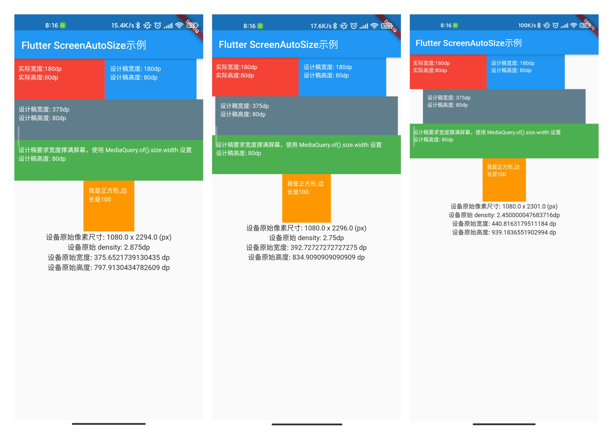
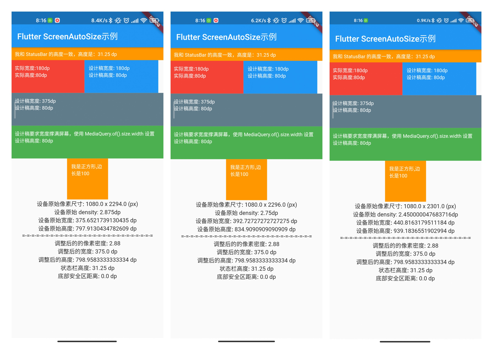

# screen_autosize

<p align="center">
   <a href="https://pub.flutter-io.cn/packages/screen_autosize">
    
  </a>
  <a href="http://www.apache.org/licenses/LICENSE-2.0">
    
  </a>
  <a href="https://juejin.cn/user/3227821828236392">
    
  </a>
</p>


🔥 A low-cost Flutter screen adaptation solution (参考今日头条 Android 屏幕适配方案的实现原理，实现的一个极低成本的 Flutter 屏幕适配方案)。

Flutter 屏幕适配方案，可做到 100% 还原设计稿。


## Notice

- 使用方法
- 实现原理（挖坑后补）

## 优势 & 劣势

### 优势：

1. 适配效果：100% 还原 UI；
2. 稳定性高：原理简单，无任何 Framework 的 Hook；
3. 侵入性低：修改点少且统一，日常编写 UI 无需特殊注意；
4. 使用成本低：统一修改，全局有效；
5. 性能损耗：几乎没有；
6. 不破坏 const Widget 常量优化；

### 劣势：

1. 全局有效，无法单页面设置，需统一同项目不同模块的设计和开发标准；
2. 编码注意点：不能使用 window 类 Api 获取尺寸信息；

## 使用方法

### 一、安装依赖

安装之前，请查看最新版本（新版本如有问题，请使用上一版本）。

```yaml
dependencies:
    flutter:
      sdk: flutter
    # 添加依赖
    screen_autosize: ^{latest version}
```

### 二、使用导包

```dart
import 'package:screen_autosize/screen_autosize.dart';
```

### 三、初始化

**Step1：设定基准屏幕宽度**

需要在 `runApp()` 之前设置，使用 AutoSizeUtils 的 initConfig() 设置设计稿的基准宽度。

```dart
void main() {
  // 这里使用 iPhone 一倍的宽度作为基准宽度；
  AutoSizeUtils.instance.initConfig(375);
  // ...
}
```

**Step2：替换 runApp()**

将原本的 `runApp()` 用 `runAutoSizeApp(MyApp())` 替换。

```dart
void main() {
  // 这里使用 iPhone 一倍的宽度作为基准宽度；
  AutoSizeUtils.instance.initConfig(375);
  // runApp(MyApp());
  runAutoSizeApp(MyApp());
}
```

**Step3: 替换 MaterialApp 生成的 MediaQuery**

MaterialApp 内部会生成 MediaQuery，需要将其通过 MediaQueryWrapper 替换。

```dart
class MyApp extends StatelessWidget {
  @override
  Widget build(BuildContext context) {
    return MaterialApp(
      title: 'Flutter Demo',
      builder: (context, widget) {
        // 替换根的 MediaQuery
        return MediaQueryWrapper(builder: (BuildContext context){
          return widget;
        },);
      },
      home: HomePage(title: 'Flutter ScreenAutoSize示例'),
    );
  }
}
// ...
```

### Step3: 开始写 UI

编码时，无任何注意点，直接按照设计图的尺寸写就行。

eg. 在 375 宽度（iPhone 1 倍尺寸）的设计稿下，一个 100x100 黄色区域，直接写参数就行，无需任何注意点。

```dart
class ColorsWidget extends StatelessWidget{
  @override
  Widget build(BuildContext context) {
    return Container(
      padding: EdgeInsets.all(10), // 不需要转换，设计稿是多少，就写多少
      width: 100,  // 不需要转换，设计稿是多少，就写多少
      height: 100, // 不需要转换，设计稿是多少，就写多少
      color: Colors.orange,
      child: Text(
        '我是正方形,边长是100',
        style: TextStyle(
          color: Colors.white,
          fontSize: 12,
        ),
      ),
    );
  }
}
```

如果要写满屏的尺寸，例如某个 Widget 宽度需要撑满屏幕，可以使用 2 种方法。

1. 利用 MediaQuery 获取：`MediaQuery.of(context).size.width`;
2. 利用 AutoSizeUtils 获取：`AutoSizeUtils.instance.mediaWidth`;

与宽度（width）对应的还有高度（height）的尺寸。

Tips：需要注意，因为库里改写了 devicePixelRatio，所以不能直接从 window 中获取对应参数。

## 效果图

未适配前：从左到右的 dip 分别是 375 → 392 → 440



未适配前：从左到右的 dip 分别是 375 → 392 → 440



## Roadmap

- 支持横竖屏切换，自动调整参数；（暂未支持）
- 支持字体尺寸倍数设置，可遵循系统设置，也可自定义；（暂未支持）

## About Me

- Email: plokmju@gmail.com
- 掘金：https://juejin.cn/user/3227821828236392
- 公众号：承香墨影（ID:cxmyDev）